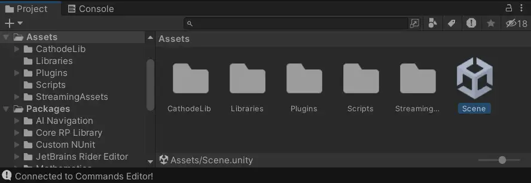

# Alien: Isolation Level Editor


A work-in-progress project to build a 3D companion to OpenCAGE's Commands Editor. The two tools should be used alongside eachother: enable the Unity connection to start a websocket between them.

This tool will eventually become a part of [OpenCAGE](https://github.com/MattFiler/OpenCAGE), but for now it exists in its own repo until it is more feature complete.

## Contents
- [Prerequisites](#prerequisites)
- [Installation](#installation)
- [Usage](#usage)
  - [Loading a scene](#loading-a-scene)
  - [Parameters](#parameters)
  - [Export](#export)
- [Common issues](#common-issues)

## Prerequisites

- [OpenCAGE](https://github.com/MattFiler/OpenCAGE)
- Unity Engine version 2022.3.9f1
- [UnityGLTF Plugin](https://github.com/KhronosGroup/UnityGLTF)

## Installation

Clone the project with the following command :

```
git clone --recurse-submodules https://github.com/OpenCAGE/LevelEditor.git
```

> **Note**: The project files to open in Unity are in **./LevelEditor/CathodeEditorUnity**

## Usage

### Loading a scene

1. Launch **OpenCage** and open the _Cathode Script Editor_. 
2. Load the desired level and in the top menu bar check Options > **Connect to Unity**
3. Load the Level Editor in Unity and open the Scene 

4. Hit the play button ▶ on the top bar above the Scene display 

> **Note**: The scene will take a few moments to load depending on the complexity of the level.
> The loaded composites can be filtered depending on the selected item in the **composite** view of the OpenCAGE Script Editor.

### Parameters

The script supports additionnal parameters. These parameters can be configured via the _Inspector_ of the **Level Loader** GameObject. 


> **Note**: save the scene after toggling a parameter on or off and hit play ▶ to reload the current scene.

| Parameter                              | Description |
|----------------------------------------| :---: | 
| Load Mover Data                        | Enable this option to load data from the MVR file, which will apply additional instance-specific properties, such as cubemaps and texture overrides. Toggle this setting before hitting play. | 
| Populate Objects With Unsupported Data | Enable this to include objects in the scene that are of an unsupported material type (they will still be inactive by default). | 
| Use Unity GLTF Materials               | Check this to load materials as GLTF supported materials (recommended). This will make the scene take longer to load but will populate the GLTF exports with extra shader data | 
| Disable MipMaps                        | Disable this to load texture on their highest resolution (takes additionnal memory but recommended for export) | 

### Export

> **Note**: gLTF is the recommended export format as additionnal data is embedded in the resulting file. This data contains additionnal shader parameters such as specularity factors, additionnal textures etc.

Exporting scene items (or a complete scene) can be done by right-clicking the desired item in the _Hierarchy_ and selecting **UnityGLTF** > **Export selected as gLTF** (or GLB). 

Export might take a few moments depending on the number of objects and the complexity of the scene.

#### Extra material data in exported GLTF files

Cathode uses proprietary shaders which take a variable amount of parameters. As is these parameters are not supported by Unity or other 3D editors. These extra parameters are nontheless added in the exported files and can be exploited/visualized by custom import scripts in your editor of choice.
